# Java课设--汽车租赁系统
- 开发工具：Eclipse
- 开发语言：Java
- 文件编码：GBK
- 数据库：MySQL
- 设计模式：工厂模式
- 架构模式：分层模式
- 项目时间：2022.6.1----2022.6.8

## 一、系统功能模块
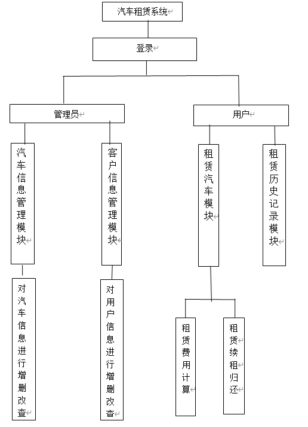

## 二、数据库设计
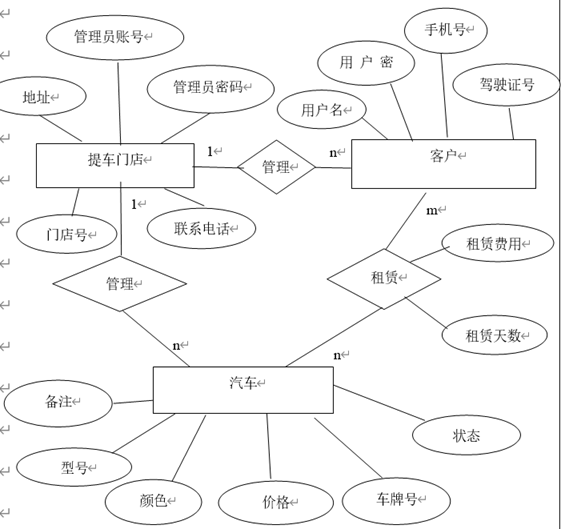

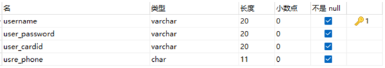

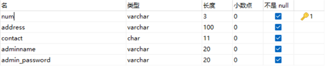

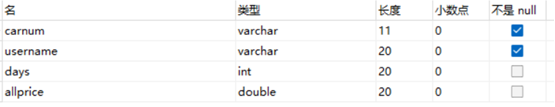

## 三、实体类设计
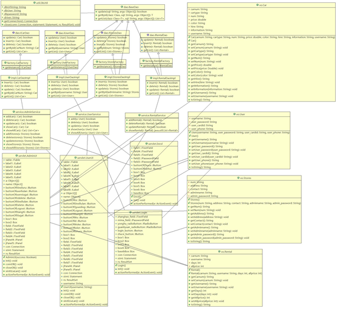

## 四、系统效果
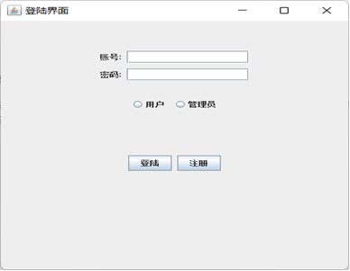

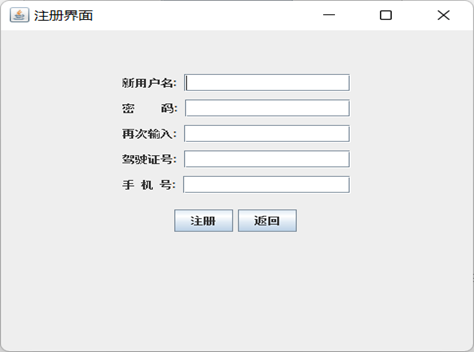

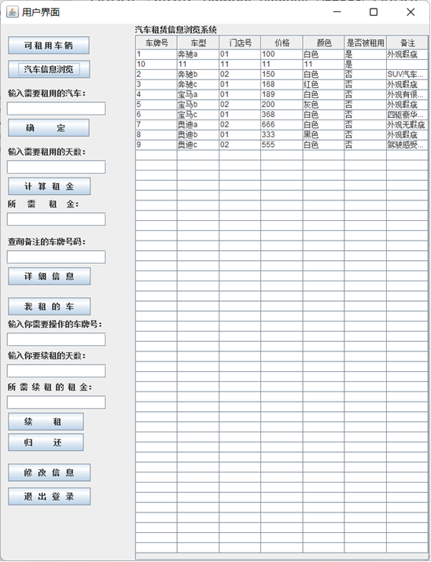
 
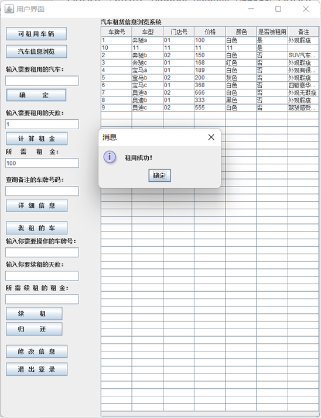
 
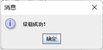
 

 
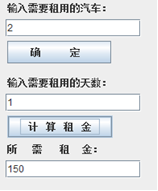
 
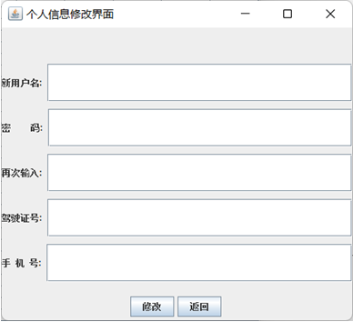
 
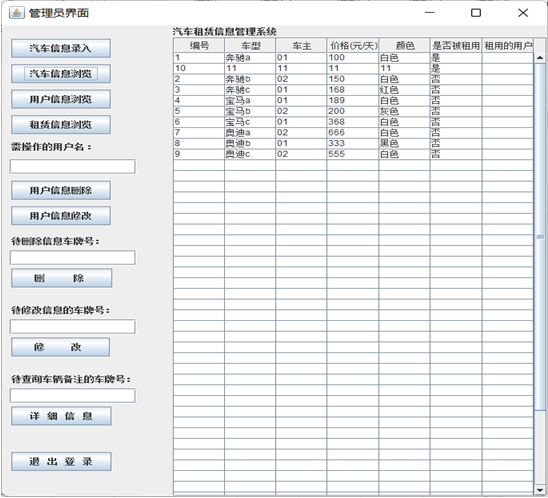
 
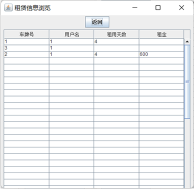
 
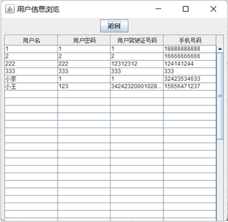
 

 
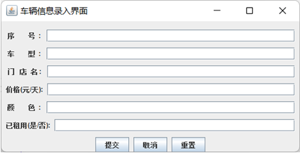
 
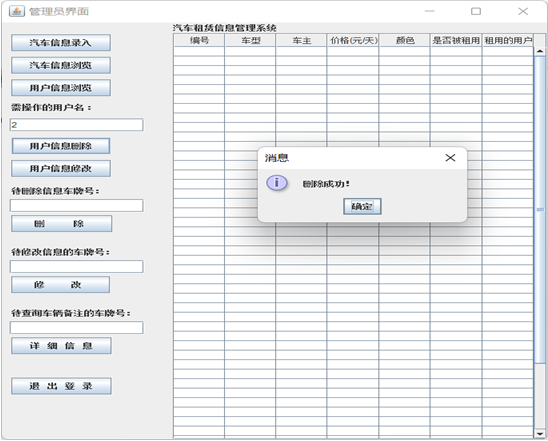
 
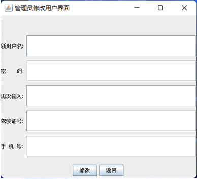
 
